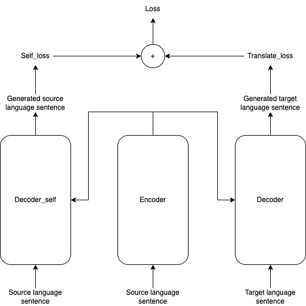
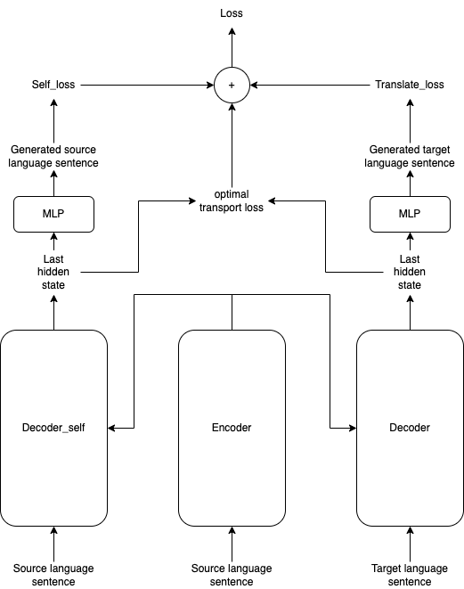
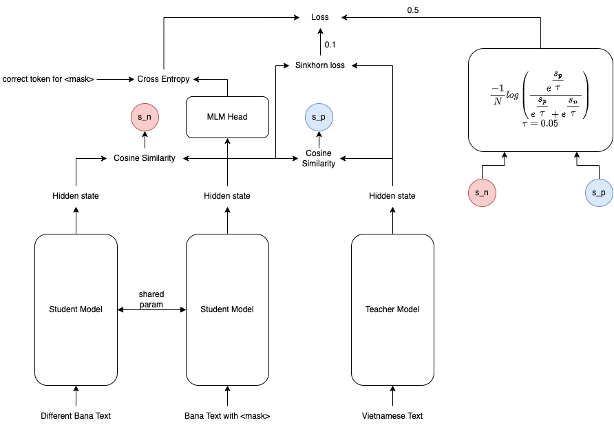

# Progress

## Compromise NMT

### With sinkhorn divergence loss

| Model | BLEU En-De | BLEU En-En |
| -------- | -------- | -------- |
| Baseline     | 18.8     | -     |
| Compromise_NMT     | 18.7     | 57.1     |
| Compromise_NMT_OT | 23.7 | 77.5 |

**Lesson learned**: 
- Encoder does know how to translate back to it original language
- OT improves the scores significantly

*Potential*: Could use this for paraphrasing.

## BanaBERT

**Repo**: [x_lingual_cl](https://github.com/TokisakiKurumi2001/x_lingual_cl)

### Text classification

**Dataset**: Bana text classification

| Model | Train Accuracy | Test Accuracy | Validation Accuracy |
| ----- | -------------- | ------------- | ------------------- |
| [GRU](https://github.com/TokisakiKurumi2001/rnn_text_classification) | 91% | 68% | 78% |
| [BanaBERT](https://github.com/TokisakiKurumi2001/banabert_cls) | 99% | **84%** | 85% |
| [TextCNN](https://github.com/TokisakiKurumi2001/cnn_text_classification) | 79% | 76% | 75% |
| BanaBERT-pretrained + OT + CL | 97% | 80% | 81% |
| **BanaBERT + OT + CL** | 98% | **84%** | 84% |
