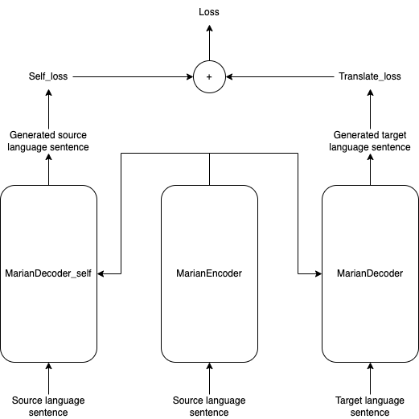

# Progress

## Compromise NMT


### With sinkhorn divergence loss


| Model | BLEU En-De | BLEU En-En |
| -------- | -------- | -------- |
| Baseline     | 18.8     | -     |
| Compromise_NMT     | 18.7     | 57.1     |
| Compromise_NMT_OT | 23.7 | 77.5 |

**Lesson learned**: 
- Encoder does know how to translate back to it original language
- OT improves the scores significantly

*Potential*: Could use this for paraphrasing.

## BanaBERT

**Repo**: [x_lingual_cl](https://github.com/TokisakiKurumi2001/x_lingual_cl)


### Text classification

**Dataset**: Bana text classification

| Model | Train Accuracy | Test Accuracy | Validation Accuracy |
| ----- | -------------- | ------------- | ------------------- |
| [GRU](https://github.com/TokisakiKurumi2001/rnn_text_classification) | 91% | 68% | 78% |
| [BanaBERT](https://github.com/TokisakiKurumi2001/banabert_cls) | 99% | 84% | 85% |
| [TextCNN](https://github.com/TokisakiKurumi2001/cnn_text_classification) | 79% | 76% | 75% |
| BanaBERT-pretrained + OT + CL | 97% | 80% | 81% |
| BanaBERT + OT + CL | 98% | 84% | 84% |
| BanaBERT + OT + CL + Mean 4 |  99% | 85% | 84% |
| **BanaBERT + OT + CL + Sum 4** |  99% | **86%** |  85% |
| BanaBERT-pretrained + OT + CL + Sum 4 | 97% | 76% | 78% |
| BanaBERT-pretrained + OT + CL + Mean 4 | 98% | 80% | 80% |
| **BanaBERT + Sum 4** | 99% | **86%** | 88% |
| BanaBERT + Mean 4 | 99% | 83% | 86% |

## TeXid

**Repo**: [TeXid](https://github.com/TokisakiKurumi2001/tense_identification)

```bash
pip install TeXid
```

This is a sequence classification. Task is the same with BanaBERT_cls. However, I have upgraded the code in order to take advantages of Huggingface API to export model and load model to use model with ease.

| Model | Train Accuracy | Test Accuracy | Validation Accuracy |
| ----- | -------------- | ------------- | ------------------- |
| **RobertaTeXid** | 99% | **100%** | 99% |

## Compromise-marian

**Repo**: [marian](https://github.com/TokisakiKurumi2001/marian)

Try to publish a library
```bash
pip install compromise-marian
```



This is a custom seq2seq transformer model. The task is to translate English sentence to France and reconstruct the original English as well. Follow the Marian Model from Huggingface library, I create a same NMT-OT architecture but with no optimal transport loss.

| Model | BLEU score | Self-BLEU score |
| ----- | ---------- | --------------- |
| Compromise-marian | 22.28 | 37.36 |

## PhrExt

**Repo**: [phrase_extract](https://github.com/TokisakiKurumi2001/phrase_extract)

Try to publish a library
```bash
pip install PhrExt
```

This is a normal Sequence tagging model using RoBERTa from huggingface. I make a little configuration to futher customize the Sequence tagging model. The original task is word chunking, the dataset used in this experiment is [CoNLL-2003](https://huggingface.co/datasets/conll2003). After the chunking is completed, a postprocess will collect the chunk and merge them into phrase (Noun phrase, verb phrase)

```text
Input: PennyLane went to the school

Output: [{'Noun Phrase': 'PennyLane'}, {'Verb Phrase': 'went'}, {'Preposition': 'to'}, {'Noun Phrase': 'the school'}]
```

| Model | Recall | Precision | F1 | Accuracy |
| ----- | ------ | --------- | -- | -------- |
| PhrExt | 82.05 | 83.44 | 82.74 | 93.12 |

## MiSeCom

**Repo**: [misecom](https://github.com/TokisakiKurumi2001/missing_sentence_component)

Try to publish a library
```bash
pip install MiSeCom
```


Task: **Missing Sentence Component**. Given an English sentence, determine if whether it miss any components.

```text
Input: I education company.
Output: I education company <ma> <mp> <mv>
```

The above sentence is missing an article, a preposition and a verb.

| Model | ROC_AUC |
| ----- | ------- |
| MiSeCom | 98.59 |

## ReWord

**Repo**: [ReWord](https://github.com/TokisakiKurumi2001/ReWord)


Try to publish a library
```bash
pip install ReWord
```

Task: **Reorder Word In Sentence**: A modification of traditional sequence labelling, but now the number of labels is equal to the vocab size.

```text
Input: I education company <ma> <mp> <mv>
Output: I <mv> <mp> <ma> education company
```

| Model | BLEU |
| ----- | ------- |
| ReWord | 94.83 |
